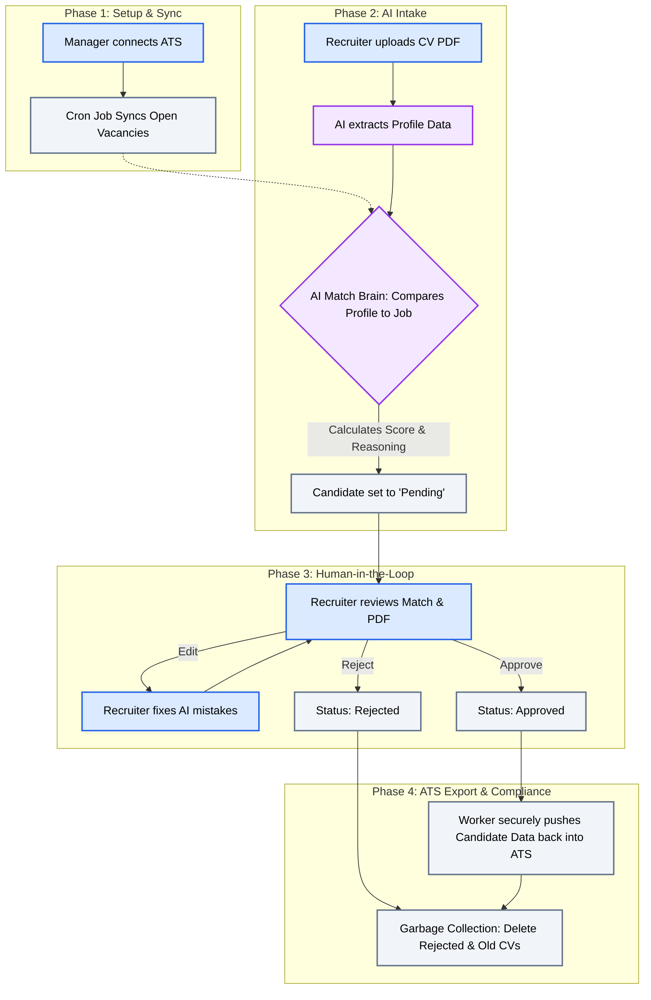

# RecruitAI

RecruitAI is a modern, multi-tenant B2B SaaS platform that automates the recruitment intake process using powerful AI models and deterministic heuristics. It processes candidate CVs in seconds, extracts skills and experience, calculates explainable vacancy matches, and syncs approved candidates to ATS systems.

Built for enterprise security, performance, and compliance with Next.js, Drizzle ORM, Supabase (Postgres RLS), Inngest, and Vercel.

---

## System Workflow



---

## Key features

### 1. Intelligent CV intake & parsing
- Structure-aware job title extraction: detects titles from headers, filenames and structured tables under Work Experience (e.g., `Senior IT Officer`, `Logistics Coordinator`, `Financial Analyst`).
- Accurate personal data detection: filters common Dutch personal-data labels (`Initials and first name`, `Personal details`, `Name:`) and strips year tokens like `2024`, `2025` from names.
- Current role duration: automatically calculates exact duration for the most recent position from date ranges (e.g., `3 years (2023 – Present)`).
- Deep skills extraction: large dictionary covering hundreds of technical, logistics, finance and admin tools & frameworks (e.g., React, PHP, Swift, Azure, Citrix, SCCM, Jira, O365, WMS, Lean Six Sigma, VCA).
- Strict data validation: prevents phone numbers, contact info or metadata from being mistaken for job titles.

### 2. Explainable AI matching
- Smart match engine: compares candidate profiles to open roles and generates a realistic match score.
- Clear explanations: shows recruiters why a candidate matches (skill overlap, relevant experience, certifications).
- Multi-LLM gateway: integrates with Google Gemini, OpenAI and Anthropic with privacy sandboxing and policy controls.

### 3. Human-in-the-loop pipeline (/app/approvals)
- Visual workflow tracker: see the intake lifecycle (Ingested → Extracted → Waiting for Approval → ATS Export).
- Keyboard shortcuts & quick actions: approve (`A`), edit (`E`), reject (`R`).
- Inline correction modal: recruiters can edit names, job titles, skills, years of experience and linked vacancies before export.
- Real-time updates: automatic refresh/polling so the UI stays in sync.

### 4. Secure inline document viewer
- Isolated PDF viewer: displays the original PDF in an overlay using in-memory blob URLs, protecting against XSS and CSP issues.
- Quick document actions: download with sanitized filenames or open in a new tab.

### 5. Automated Vacancy Ingestion (Webhooks & ATS Sync)
- Webhook endpoints: securely accept external job descriptions (`/api/webhooks/vacancies`) and automatically parse them into structured AI rules.
- ATS Sync Cron Jobs: durable Inngest cron jobs (`syncAtsVacancies`) run hourly to pull open jobs from providers like Bullhorn, Recruitee, and OTYS.
- Zero-Trust ATS Key Management: AES-256 encrypted storage for Tenant ATS API keys.

### 6. Robust background processing & ATS export (Inngest)
- Asynchronous processing: heavy PDF extraction and AI tasks run non-blocking in serverless Inngest workers.
- Pausable workflows: workflows can wait for human approval (up to 7 days) before performing ATS exports.
- GDPR & Storage lifecycle: automated garbage collection enforces a rolling 20-CV retention limit per tenant and instantly drops `REJECTED` candidate files to prevent database bloat and ensure compliance.

### 7. Enterprise security & multi-tenancy
- Row Level Security (RLS): strict tenant isolation at the database level (`tenant_id`).
- Real-time DDoS protection: edge-level in-memory sliding-window rate limiting (`proxy.ts`) to prevent malicious webhook spam from draining OpenAI API credits.
- Enterprise SSO: sign-in via Google and Microsoft Entra ID (Azure AD).
- Audit logging & security events: auditable logs for every upload, edit and status change.

---

## Tech stack

| Area | Technology |
|---|---|
| Framework | Next.js 15+ (App Router, React 19, React Server Components) |
| Database | PostgreSQL (Supabase Cloud with RLS policies) |
| ORM | Drizzle ORM |
| Auth | Auth.js (NextAuth v5) with Google & Microsoft Entra ID |
| Background jobs | Inngest (durable execution & event-driven queues) |
| AI orchestration | Vercel AI SDK (Google Gemini, OpenAI, Anthropic) |
| UI | Tailwind CSS v4 + Lucide React Icons |
| Testing | Vitest (unit) & Playwright (E2E) |
| Hosting | Vercel |

---

## Getting started

### 1. Clone the repo & install

```bash
git clone https://github.com/FranklinFranklin/recruitai.git
cd recruitai
npm install
```

### 2. Configure environment variables

Create a `.env.local` file in the project root and add the keys below:

```env
# Database connection (use Supabase pooler port 6543 in production)
DATABASE_URL="postgresql://postgres:[PASSWORD]@[HOST]:5432/postgres"

# NextAuth v5
AUTH_SECRET="generate_a_strong_key_with_openssl_rand_hex_32"
NEXT_PUBLIC_APP_URL="http://localhost:3000"

# SSO providers
AUTH_GOOGLE_ID="your_google_client_id"
AUTH_GOOGLE_SECRET="your_google_secret"
# AUTH_MICROSOFT_ENTRA_ID_ID=""
# AUTH_MICROSOFT_ENTRA_ID_SECRET=""
# AUTH_MICROSOFT_ENTRA_ID_TENANT_ID=""

# Inngest
INNGEST_EVENT_KEY="local"
INNGEST_SIGNING_KEY="local"

# Optional LLM API keys for live calls
OPENAI_API_KEY=""
ANTHROPIC_API_KEY=""
GOOGLE_GENERATIVE_AI_API_KEY=""
```

### 3. Sync the database schema

```bash
# Push the Drizzle schema to your database
npx drizzle-kit push

# (Optional) Seed initial test data
npm run db:seed
```

### 4. Start the dev server

```bash
npm run dev
```

Open http://localhost:3000 in your browser.

---

## Tests & quality checks

Run the full test suite before committing:

```bash
# Unit tests
npm run test:unit

# TypeScript type check
npx tsc --noEmit

# End-to-end tests
npm run test:e2e
```

---

## Project structure

```text
src/
├── app/
│   ├── (auth)/             # login & auth flows
│   ├── api/webhooks/       # automated inbound CV & Vacancy ingestion endpoints
│   ├── admin/              # system admin, tenants, users & health
│   └── app/                # recruiter dashboard
│       ├── approvals/      # human-in-the-loop approvals & inline PDF viewer
│       ├── candidates/     # candidate list & archive
│       ├── settings/       # tenant admin ATS integrations & webhook URLs
│       └── upload/         # drag & drop CV intake
├── lib/
│   ├── ai/
│   │   ├── cv-extractor.ts # heuristics, section parsing, skills & title extraction
│   │   └── gateway.ts      # multi-LLM orchestration & sandboxing
│   ├── auth/               # NextAuth v5 config & role permissions
│   ├── db/
│   │   ├── index.ts        # database client & tenant RLS helper
│   │   └── schema.ts       # Drizzle schema
│   ├── integrations/ats/   # AES-256 encrypted multi-provider ATS sync layer
│   └── workflows/
│       ├── actions.ts      # server actions (upload, approve, edit, GC cleanup)
│       └── functions/      # Inngest durable workflows & hourly sync crons
tests/
├── unit/                   # Vitest unit tests (CV parser, policy engine)
└── e2e/                    # Playwright end-to-end tests
```

---

## Compliance & security

- Data isolation: every DB query runs in the context of the active tenant (`withTenant`).
- CSP & iframe protection: the PDF viewer uses secure client-side object URLs with automatic memory revocation.
- GDPR: temporary source files are removed after processing and optional anonymization is supported.

---

Built with care for the next generation of AI-powered recruitment.
